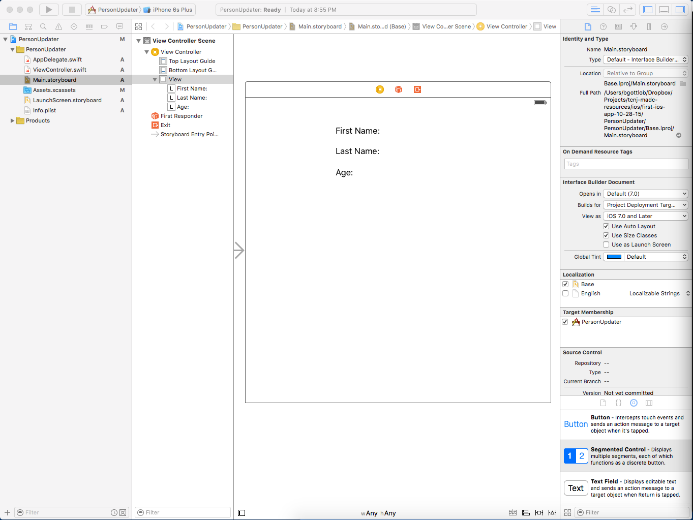

# First iOS App Tutorial
## Getting Started
- To start, open Xcode and select *Create a new Xcode project*
    - Under the iOS templates, select *Application* then select *Single View Application* and click *Next*
    - Set your product name to *PersonUpdater*
    - The Organization Name and Identifier can be left at their default values
    - Select your language to be *Swift* and your Devices as "iPhone"
    - Uncheck all three boxes at the bottom of the window
    - Then click *Next*
- Don't worry much about all of the files that are created for you; for the purposes of this tutorial, just know:
    - `Main.storyboard` - We will be dragging and dropping visual elements to create the UI in this file
    - `ViewController.swift` - Code that modifies the UI that we have created will be written here
        - That code includes code that is triggered when buttons are pressed
        - Don't worry about the default code that is written in here; just don't touch it

## Creating the User Interface
- Open Main.storyboard, then open the View Controller Scene so you get a view of a white rectangle - this rectangle represents our screen
- Add a UILabel to your view using the object library at the bottom right corner of the window
    - Set the default text to "First Name:"
    - Create two more labels with the default text "Last Name:" and "Age:" so you end up with a view that looks like this:
    
- Next, create three buttons labeled "Person 1", "Person 2", and "Person 3" and place them below the labels
- Next, add autolayout constraints to each UI element
    - Highlight all the UI elements and click the button with this icon at the bottom of the UI editor:
    
    - In that view, check *Horizontally in Container* then click *Add Constraints*
    - Now that the x coordinate constraint has been set, y coordinate constraints must be set
        - Control-click on the "First name" label and drag the blue line onto the space above that label and let go
            - Select "Vertical Spacing to Top Layout Guide"
                - This sets a constraint for a set amount of space between the top of the screen and the top of the label
                - This value can be modified by clicking the vertical line that appears from this action
        - Do this for the "Person 3" button, except drag the line in this space towards the bottom of the screen and select *Vertical Spacing to Bottom Layout Guide*
        - Next, repeat this process by control-dragging the "First Name:" label to the "Last Name:" label and selecting *Vertical Spacing*
        - Repeat this process for "Last Name:" to "Age:" and so on for the vertical spacing between each UI element
        - Finally, select all of the UI elements, then, click this icon at the bottom of the UI editor:
        
            - Check the *Width* and *Height* boxes then click *Add Constraint*
        - When using autolayout constraints, constraints must be set for X,Y,Width,and Height
        - Learning how to utilize and debug autolayout will help in the future when creating resizeable user interfaces that can scale to various devices
        - Autolayout will be covered in more depth in later tutorials
            - The constraints set for this tutorial are very rigid, but it gets your feet wet with how some of these tools work

## The Source Code
### Changes to `Person.swift`
- Drag the `Person.swift` file from the last tutorial to the file explorer in your Xcode project
    - Be sure that the *Copy Items if Needed* is checked and that the *Add to Targets* checkbox next to "PersonUpdater" is checked
- Once this file is copied, remove the code for the the `enterInfo()` function
    - This app will not be accepting any input via the command line so that code is not necessary
    - Also delete the `printInfo()` and `changeFirstName()` functions
- Add the following code to the Person class:
```swift
// Create an initializer function that sets initial values to attributes on object creation
// This concept is the same as constructors in Java
init (firstName: String, lastName: String, age: Int) {
/*
 * self refers to the object that is calling this method - in the case of an initlializer,
 * self is just the object being created.
 * The variable names preceded by self refer to the newly-created Person object's attributes.
 * The variable names not preceded by self refer to the parameters passed into the function.
 */
    self.firstName = firstName
    self.lastName = lastName
    self.age = age
 }
 ```
### Changes to `ViewController.swift`
- Navigate to the `ViewController.swift` file
- Declare an attribute to hold an array of people in the ViewController class with `var people: [Person] = []`
- Inside the `viewDidLoad()` function (underneath the `super.viewDidLoad()` call), add the following code:
```swift
    // Utilize the initializer to create three Person objects and add them to the people array
    let newPerson1 = Person(firstName: "Han", lastName: "Solo", age: 35)
    people.append(newPerson1)
    let newPerson2 = Person(firstName: "Luke", lastName: "Skywalker", age: 22)
    people.append(newPerson2)
    let newPerson3 = Person(firstName: "Ben", lastName: "Kenobi", age: 75)
    people.append(newPerson3)
```
- In this ViewController class, add an attribute for each of the three labels like so:
    1. Open `Main.storyboard` in the Assistant Editor, denoted by this icon:
    
    2. Control-drag from the label to an empty space inside the ViewController class code
    3. Create a variable name for the label, then click connect in the popup view (just accept all of the default settings)
    - This action should generate the following code for you:
    ``` swift
    @IBOutlet weak var firstNameLabel: UILabel!
    @IBOutlet weak var lastNameLabel: UILabel!
    @IBOutlet weak var ageLabel: UILabel!
    ```
- Next, add action methods for each button by repeating the process done for the labels, except modify the *Connection* option to *Action*, then click *Connect*; this will generate the following code:
``` swift
@IBAction func clickPerson1(sender: AnyObject) {
}

@IBAction func clickPerson2(sender: AnyObject) {
}

@IBAction func clickPerson3(sender: AnyObject) {
}
```
- In the `clickPerson1()` function, add this code:
``` swift
@IBAction func clickPerson1(sender: AnyObject) {
    // Get the first person in the people array
    let person = people[0]

    // Set the label text attribute to each attribute of the person object
    // This has the effect of updating the text in the labels, displying the person data to the user
    firstNameLabel.text = "First Name: \(person.firstName)"
    lastNameLabel.text = "Last Name: \(person.lastName)"
    ageLabel.text = "Age: \(person.age)"
}
```
- Fill in the code for the other two actions to populate the labels with the data about the other people

## Just Do It
- Go ahead and pick an iPhone model at the top of the Xcode window, then click the giant play button to try out your app

## Questions?
- If you have any questions, feel free to contact me at gottlob1@tcnj.edu
- A fully-functioning version of this code is avaialble on this repo - have fun!
